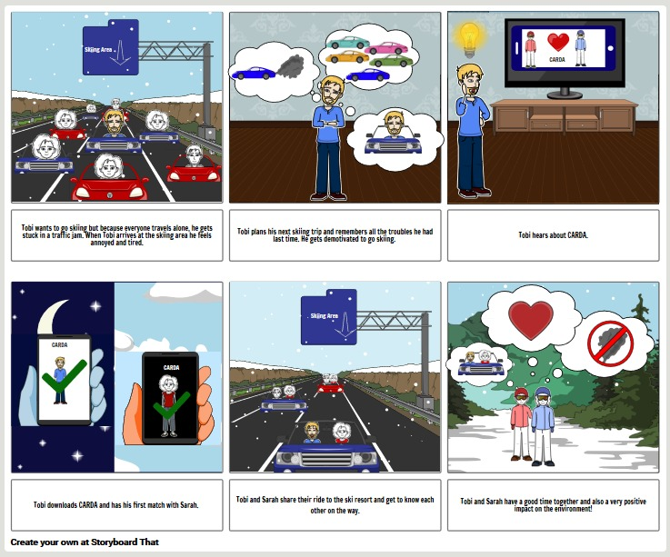

# CarDa By Team Reeb
Throughout the International virtual innovation challenge, team Reeb got the assignment to create a digital solution, that contributes in making skiing more sustainable.
After interviewing stakeholders, who mostly said, that they usually go skiing by car, evebthough they know its not good for the environment, team Reeb came up with the idea of CarDa.

## What is Carda?

CarDa is an App, to find people near you to go skiing with. The main idea is, that the person offering a ride is searching for friends or a date and inserts his ride into CarDa, with all the information needed. 
The users who are asking for a ride than can see the offered rides and can "match" with the person offering it. In the ideal case, the driver will pick up the other person and they will share the ride. In the end both will have saved CO2, because they only used one instead of two cars.

## Storyboard
The following storyboard, that has been created for CarDa, is showing, how the team imagined the usage of the app.

## Why should someone use CarDa?

Obviously, the person offering a ride and paying the fuel, should have some benefits as well. Therefore CarDa will forge some partnerships wiht local businesses in the skiing areas. After the ride has been done, the driver can than claim benefits like a free parkinglot or discount on food or drinks in the skiing area.
All users, who use CarDa, will at least have a less bad consience, because they will have a smaller CO2 footprint, then if they would go with their own car.

## Business model of CarDa

CarDa is not just a gimmick to show, that DSV is trying to be more sustainable, but it can also be moetarized as well. The revenue Streams can be broken down into 3 main streams:
  1. Advertisement: CarDa implements multiple slots to add advertisement to the app, that will be rolled out to all the free users. These slots can be sold to companys to earn          money
  2. Premium version: Like in many so called "freemium" apps, users will be able to get an advertisment free version of the app, if they pay for the usage. The premium version          wont only give the users a better user experience, but premium users will also get better benefits in the skiing areas then free users.
  3. Partnerships with local businesses: In the starting phase, CarDa will need some founding partnerships, to be able to provide benefits for the driver from the begining.          After this is achieved, CarDa will start a membership program for businesses. In this case the business will pay a small amount of money monthly and provide benefits.            Therefore the businesses can expect, that users of CarDa will be more likely to e.g. eat in a specific restaurant where they get a discount instead of going to another          restaurant where they would have to pay the full price.

## Other benefits:

CarDa is supposed to be something benefitial for all involved parties. 
- User benefits:
  1. The user who offers a ride, will get benefits directely in the skiing area.
  2. The user, who asked for the ride will get a free lift to the skiing area.
  3. The users have a less bad consience, because they did not exhaust as much CO2, as if they would not have used CarDa and can see how much they saved as well.
  4. All users will meet new people with similar interests and hopefully will make friends or even more
  
- DSV benefits:
  1. DSV will be able to collect certain data of the users, which will enable them, to analyze the data and draw conclusions for their next steps, events, etc.
  2. Contribution to a good and sustainable reputation for beeing sustainable
  3. Potentially CarDa can also earn DSV some money, as explained above

- Business partners benefits:
  1. The local businesses, can create an adventage, to other businesses in the same area
  2. Cheap advertisement, that is only rolled out to people, who will be in the area for sure

We hope that as a user, you are interested in our product! If you want to find out more about our product Carda, you can also check out our Github repository and Wiki.

GitHub Page: https://gxc-int-innovation-challenge21.github.io/gxc-team-11/

Wiki: https://github.com/gxc-int-innovation-challenge21/gxc-team-11/wiki
